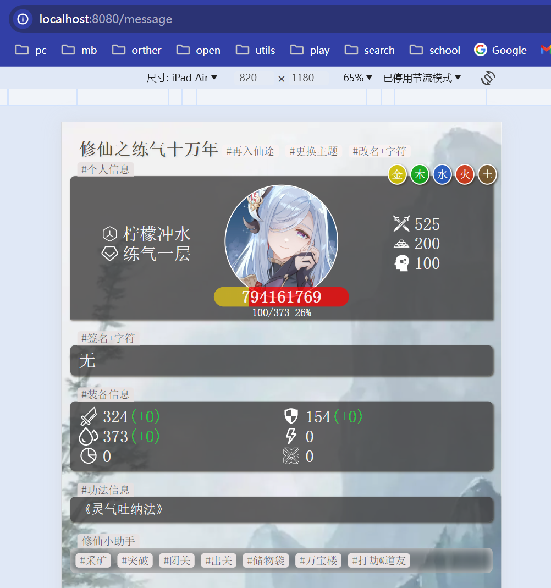

# 喵仔修仙插件

> 这是一款为喵仔设计的修仙插件，使用 ts 和 tsx 进行编写。在使用前,需要进行编译后才能使用



## 部署

- 安装项目

miao-yunzai 目录

```sh
git clone  --depth=1 https://gitee.com/ningmengchongshui/xiuxian-plugin.git ./plugins/xiuxian-plugin
# 进入xiuxian
cd ./plugins/xiuxian-plugin
```

或者 plugins 目录中执行

```sh
cd ./plugins
```

```sh
git clone  --depth=1 https://gitee.com/ningmengchongshui/xiuxian-plugin.git
```

```sh
# 进入xiuxian
cd ./xiuxian-plugin
```

- 安装依赖

选择你可以执行的工具进行加载

```sh
npm install yarn -g
yarn
```

```sh
# 或者
npm install pnpm -g
pnpm install
```

```sh
# 或者
npm install cnpm -g
cnpm install
```

- 执行打包

打包生产 `index.js`

```sh
npm run build
```

插件识别文件,必须打包后才能生产

## 更新

- xiuxian-plugin 目录中执行

```sh
git pull
```

- 加载更新脚本

```sh
npm run update
```

- 执行打包

```sh
npm run build
```

## 开发

- 启动图片热开发

```sh
npm run image:dev
```

访问地址 `http://localhost:8080/message`

- 启动 WEB 管理器

```sh
npm run koa:dev
npm run vite:dev
```

后端地址 `http://localhost:9090/api`

前端地址 `http://localhost:5173/`

账户密码 `123456`

- 后端负载均衡

```sh
npm run koa:build #编译
npm run start #后台运行
npm run kill #杀死进程
```

- 前端负载均衡

对项目进行打包后

使用 Nginx 部署 dist 目录即可

```sh
npm run build #打包
```

## 优势

该仓库使用一系列的现代化开发工具，确保问题能在开发时就能解决！

对于图片的开发，采用了 tsx&koa&nodemon 的结合，不仅能热开发图片，还自制了`puppeteer`截图工具，确保机器人进行截图时能完美的保持原有效果。

我们更倾向于项目的使用人员是游戏管理员，为此设计的 WEB 管理系统将有利于你更好的运营游戏

## 商用

> 该插件允许自由安装修改,插件内的素材部分来自网络,在商用前,请自行替换素材

> 该仓库有强烈的版权诉求,禁止除作者外,任意以仓库开发成员，团队名义或有损成员权益的行为作为商用噱头

## 联系

Bot Dev QQ-Group 806943302

Game Play QQ-Group 925976815
